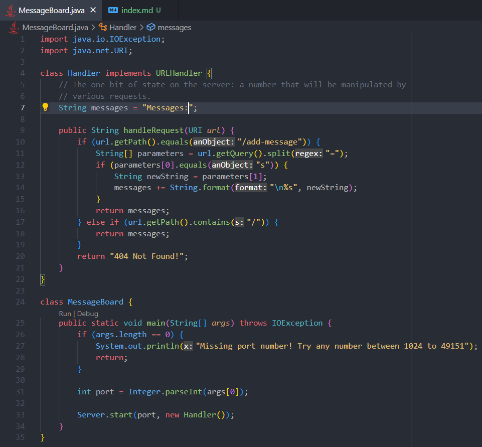
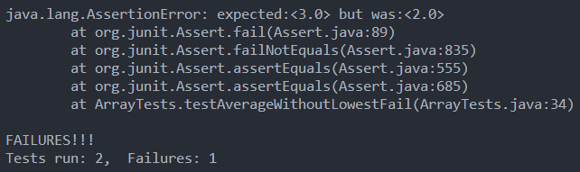

# Lab Report 2 - Servers and Bugs

## Part 1 - String Server

In this part, I created a server in which we can add messages to using the `/add-message` path, along with the `s=[insert message here]` query. <br/>


Here are two screenshots of messages being added. <br/>


- When first starting up the server, the `main` method is called. It then starts the server with the inputed port number. When the user visits the website (in my example, http://localhost:4000) The `handleRequest` method is then called in order to handle the request from the user.
- The `url` is the most relevant argument for the handle request method. It contains the path and query parameters that are needed for the program to work. The `messages` variable that belongs to the class is also essential to having this program work. It is a single string with all of the messages separated by a line break.
- the `url` is different for this request, as the `s` query parameter has changed to `"hello world"`. Furthermore, the path here is `/add-message`, which allows the program to understand that a message is to be added. <br/>


- Similar to the last request, `handleRequest` is again called. The main method has already been called once to start the program, so only `handleRequest` has been called.
- Again, the relevant argument here is `url`. `messages` as well is very relevant, as explained above.
- Here, `url` is different, as the query parameter `s` is different than the one shown above. Also, `messages` has been updated to include `hello` from the previous request, which persists to this current request.

## Part 2 - Bug Testing

The bug I am going to choose is with the method `averageWithoutLowest` in `ArrayExamples.java`.

```
// Averages the numbers in the array (takes the mean), but leaves out the
// lowest number when calculating. Returns 0 if there are no elements or just
// 1 element in the array
static double averageWithoutLowest(double[] arr) {
    if(arr.length < 2) { return 0.0; }
    double lowest = arr[0];
    for(double num: arr) {
        if(num < lowest) { lowest = num; }
    }
    double sum = 0;
    for(double num: arr) {
        if(num != lowest) { sum += num; }
    }
    return sum / (arr.length - 1);
}
```

Here, the failure inducing test will be with an input of `{2, 2, 4}` and an expected output of `3.0`, since `(2+4)/2 = 3`. However, the test fails with an actual output of `2.0`.

```
@Test
public void testAverageWithoutLowestFail() {
    double[] input1 = { 2, 2, 4 };
    assertEquals((double) 3, ArrayExamples.averageWithoutLowest(input1), 0.001);
}
```

The successful test will be with an input of `{2, 4, 4}` and an expected output of `4.0`. The test passes successfully, as the actual output is `4.0`.

```
@Test
public void testAverageWithoutLowestSuccess() {
    double[] input1 = { 2, 4, 4 };
    assertEquals((double) 4, ArrayExamples.averageWithoutLowest(input1), 0.001);
}
```

For the symptom, here is the output of running these two tests. <br/>

The bug here is that the method discards all lowest values, including duplicates, when it should just be discarding a single value. In order to fix this, we are going to keep track if we have discarded a value yet, and once we have discarded a value, we will include all other values in the sum.

Before (with error):

```
static double averageWithoutLowest(double[] arr) {
    if(arr.length < 2) { return 0.0; }
    double lowest = arr[0];
    for(double num: arr) {
        if(num < lowest) { lowest = num; }
    }
    double sum = 0;
    for(double num: arr) {
        if(num != lowest) { sum += num; }
    }
    return sum / (arr.length - 1);
}
```

After (fixed):

```
static double averageWithoutLowest(double[] arr) {
    if (arr.length < 2) {
        return 0.0;
    }
    double lowest = arr[0];
    for (double num : arr) {
        if (num < lowest) {
            lowest = num;
        }
    }
    double sum = 0;
    boolean hasDiscarded = false;
    for (double num : arr) {
        if (!hasDiscarded && num == lowest) {
            hasDiscarded = true;
            continue;
        }
        sum += num;
    }
    return sum / (arr.length - 1);
}
```

This fixes the issue because once we have encountered a lowest value within the array, we set a flag that we have discarded such a value and we then include everything else, including duplicate lowest values (which is supposed to be intended, as in the `return` we divide by `(arr.length - 1)`).

## Part 3 - Conclusion

- Before these last two labs, I had never used JUnit or written tests of any kind. It was interesting to learn about and I definitely see the benefits of writing such tests. VSCode especially makes testing really nice, as the interface shows exactly which ones fail and allows running each test independently and with debugging enabled.
- I also didn't know about that Java could handle server requests and responses. It was really fun to create a little server program and run it on the remote machine. It felt like my own little website, especially when I added numbers from one computer and saw those changes on my laptop.
